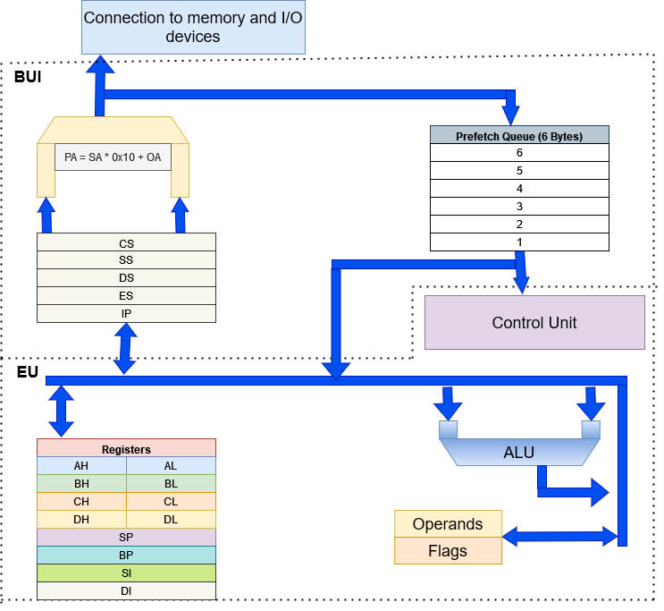

# The Holy Book of 8086

Programs written for the 8086 architecture in assembly language, that could be located in the boot-sector of an IBM-compatible environment.
The boot sector can hold up to 510 bytes. The project is based on the book Programming boot sector games by Oscar Toledo G.

## Setup

Install NASM, and DOS-BOX.

### Building

Builds the exectable

```
nasm -f bin <Assemblyfile> -o <Outputfile>
```

### Executing a program

Add the following lines to your doxbox.conf file

```
MOUNT C <ExecutableFolder>
C:
```

## 8086

### Architecture



#### The Bus interface unit (BIU)

The BIU provides the 8086 with acces to external memory and I/O devices and with a 6 Byte prefetch queue. This is because the biggest instruction that the microprocessor can process has a size of 6 Bytes.

#### Control Unit

The Control unit decodes the instructions stored in the pre-fetch-Queue.

#### Execution Unit

The execution unit contains the general purpose registers AX, BX, CX and DX.

### Instruction set

#### Arithmetic instructions

| Opcode | Usage    | Description                                                                         |
|--------|----------|-------------------------------------------------------------------------------------|
| AAA    | AAA      | Adjust accumulator after addition                                                   |
| AAD    | AAD      | Adjust accumulator after division                                                   |
| AAM    | AAM      | Adjust accumulator after multipliction                                              |
| AAS    | AAS      | Adjust accumulator after subtration                                                 |
| ADC    | ADC A, B | Computes A + B + the prevoius carry and stores the result in A                      |
| ADD    | ADD A, B | Computes A + B and stores the result in A                                           |
| CBW    | CBW      | converts signed byte to word                                                        |
| CWD    | CWD      | converts signed byte to double word                                                 |
| DAA    | DAA      | decimal adjust accumulator                                                          |
| DAS    | DAS      | decimal adjust accumulator after subtraction                                        |
| DEC    | DEC A    | Decrements the value in the specified register by one                               |
| DIV    | DIV X    | Computes AX / X and stores the result in AX and the remainder in DX                 |
| DIV    | DIV X    | Computes signed division AX / X and stores the result in AX and the remainder in DX |
| INC    | INC A    | Increments the value in the specified register by one                               |
| MUL    | MUL X    | Computes AX * X and stores the result in AX                                         |
| NEG    | NEG X    | Negates / stores the 2's complement of the register value in the register           |
| SBB    | SBB A, B | Computes A - B - the prevoius carry and stores the result in A                      |
| SUB    | SUB A, B | Computes A - B and stores the result in A                                           |

#### Logical instructions

### Interrupts

### Memory segments

The memory of computer is divided into four segments:

* Code segment (CS)
* Data segment (DS)
* Extra segment (ES)
* Stack segment (SS)

For each of these segments a special purpose register, that stores the base address (address of the start of the segment) of the segment, is provided.
These registers are part of the BUI of the processor.

### Flags

| Name                      | Description                                                                                                                   |
|---------------------------|-------------------------------------------------------------------------------------------------------------------------------|
| CF (Carry Flag)           | Signals an overflow after a arithmetic operation                                                                              |
| SF (Sign Flag)            | Set if the result of an arithmetic operation is negative                                                                      |
| ZF (Zero Flag)            | After any arithmetical or logical operation if the result is 0 (00)H, the zero flag becomes set                               |
| AC (Auxiliary Carry flag) | This flag is used in the BCD number system                                                                                    |
| PF (Parity flag)          | If the result of an arithmetic or logical operation has even parity this flag is set                                          |
| O (Overflow flag)         | This flag will be set if the result of a signed operation is too large to fit in the number of bits available to represent it |

#### Control Flags

| Name                      | Description                                                                                                                   |
|---------------------------|-------------------------------------------------------------------------------------------------------------------------------|
| D (Directional Flag)      | Signals an overflow after a arithmetic operation                                                                              |
| I (Interrupt Flag)        | Set if the result of an arithmetic operation is negative                                                                      |
| T (Trap Flag)             | Used for on-chip-debugging. Setting the flag puts the 8086 into single step mode                                              |

## Resources

### English

[Setup and Installation of DOS-BOX](https://www.dosbox.com/wiki/Basic_Setup_and_Installation_of_DosBox)

### German

[8086/8088 Reference](https://www.i8086.de/)

[8086 Handbook (German)](https://www.pearson.ch/download/media/9783827320148_SP.pdf)
